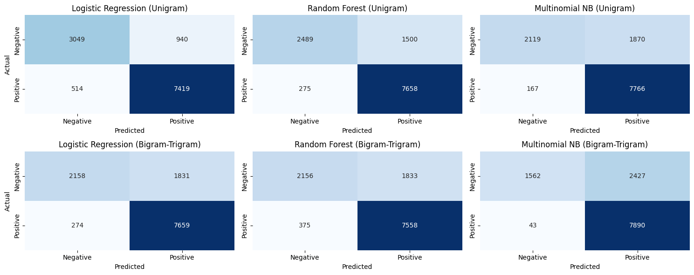

# Human Mobility and Text-Based Spatial Analysis  
## Case Study: Cambridge (UK) & Calgary (Canada)

  
  
  
  

---
## Overview

This project explores the integration of geospatial mobility data and natural language text analysis to uncover spatial patterns in human behaviour and public perception.

Using:

- Gowalla mobility check-in data from Cambridge, UK  
- Amenity review texts from Calgary, Canada  

The study investigates how movement patterns and textual sentiment can jointly inform urban spatial analysis.

The central question:

> How can mobility trajectories and text-based sentiment modelling be combined to better understand spatial dynamics and place perception?

---

## Key Contributions

1. **Mobility-Based Spatial Pattern Analysis**  
   Analysed Gowalla check-in data to identify spatial clustering and movement trends within Cambridge.

2. **Sentiment Analysis using VADER**  
   Applied rule-based sentiment modelling to Calgary amenity reviews to quantify public perception of urban locations.

3. **Topic Modelling for Place Characterisation**  
   Used topic modelling techniques to extract dominant themes from amenity review texts.

4. **Integrated Spatial-Textual Interpretation**  
   Connected sentiment and topic signals with geographic distribution to interpret socio-spatial dynamics.

---

## Methodology

### Data

- Gowalla mobility dataset (Cambridge, UK)
- Amenity review texts (Calgary, Canada)

### Techniques

- Spatial clustering and distribution analysis
- VADER sentiment analysis
- Topic modelling (LDA)
- Confusion matrix evaluation (classification validation)

### Tools

- Python
- Pandas
- Scikit-learn
- NLTK / VADER
- GeoPandas
- Matplotlib / Seaborn

---

## Results Summary

The study demonstrates that:

- Mobility check-in patterns reveal concentrated spatial hubs within Cambridge.
- Sentiment polarity varies significantly across amenity categories in Calgary.
- Topic modelling identifies recurring themes related to service quality, accessibility, and environment.
- Integrating geospatial and textual signals enables richer spatial interpretation beyond movement data alone.

---

## Why This Matters

Urban datasets increasingly combine location and text (geotagged content, reviews, social media).

This project illustrates how:

- Text-based sentiment modelling enhances spatial analytics.
- Public perception can be mapped geographically.
- Mobility and natural language processing can be integrated into unified urban intelligence frameworks.

Applications include:

- Urban planning
- Place-based reputation analysis
- Smart city analytics
- Location-based recommendation systems

---

## Repository Structure

- `images/` – Visualisations and modelling outputs  
- `Main_code_gowalla.ipynb` – Core analysis notebook  
- `Analysis_doc_gowalla.pdf` – Full research document  
- `README.md`  

---

## Author

Mohamad Rendy Irawan Ifran  
MSc Social & Geographic Data Science  
University College London
