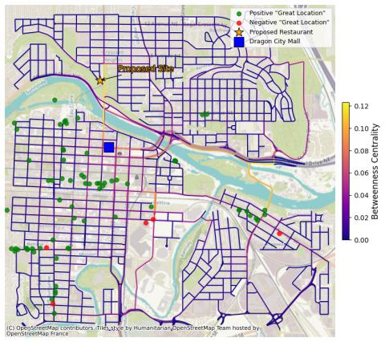
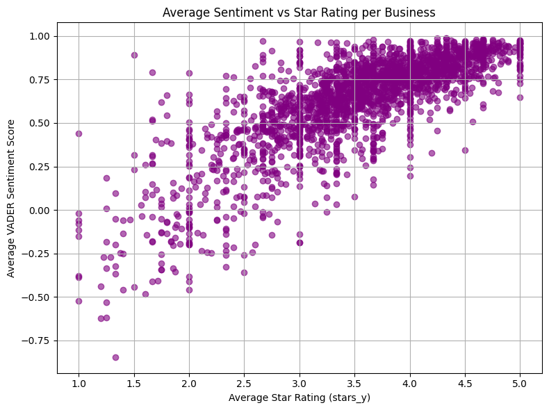
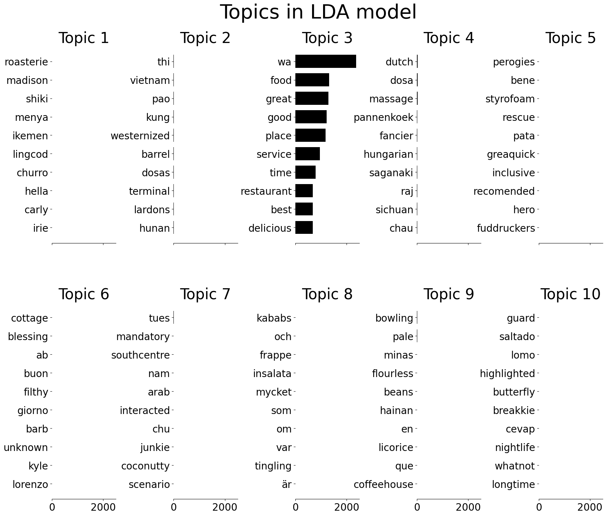

# Human Mobility and Text-Based Spatial Analysis  
## Case Study: Cambridge (UK) & Calgary (Canada)

  
  
  

---

## Overview

This project integrates mobility analytics and natural language processing to explore how spatial behaviour and public perception can inform urban decision-making.

Using:

- Gowalla mobility check-ins (Cambridge, UK)  
- Restaurant review texts (Calgary, Canada)  

the study demonstrates how geospatial and textual data can jointly support infrastructure and site-selection analysis.

---

## Part I — Cambridge: Mobility & Park Proposal

**Objective:**  
Use check-in data to model movement patterns and propose potential new community park locations.

**Approach:**
- Computed shortest-path distances from user check-in sequences.
- Conducted spatial centrality analysis to identify high-accessibility zones.
- Proposed candidate park locations in areas with movement density but limited green access.

---

## Part II — Calgary: Restaurant Review Modelling & Site Selection

**Objective:**  
Predict restaurant review scores and identify optimal locations for new restaurant development.

### Supervised Learning
- Trained classification models to predict review scores from text.
- Evaluated using confusion matrices and classification metrics.

### Spatial-Textual Insight
- Extracted reviews mentioning “great location.”
- Included negative reviews to capture spatial desirability independent of service quality.
- Categorised keywords into:
  - Natural features (river, park, hills)
  - Urban structures (downtown, main street)
  - Experiential qualities (quiet, vibrant)

This framework operationalises customer-defined spatial perception for location intelligence.

---

## Ethical & Methodological Considerations

- Mobility data carries re-identification risk and requires anonymisation safeguards.
- Spatial centrality should be complemented with contextual urban variables for real-world application.

---

## Tools

Python · Pandas · Scikit-learn · NLTK/VADER · GeoPandas · Network analysis

---

## Repository Structure

- `images/` – Visual outputs  
- `Main_code_gowalla.ipynb` – Analysis pipeline  
- `Analysis_doc_gowalla.pdf` – Full report  
- `README.md`  

---

## Author

Mohamad Rendy Irawan Ifran  
MSc Social and Geographic Data Science  
University College London
